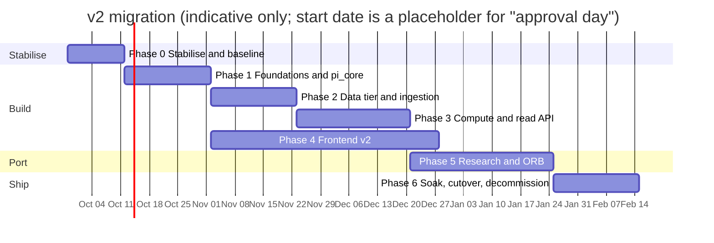

# Portfolio Intelligence v2 — Migration Plan (v1 → v2)

**Status:** draft for approval · 21 Sep 2026
**Strategy:** strangler. v2 is built beside v1, verified against golden fixtures, run in shadow, then cut over. v1 stays running and untouched until then. See ADR-0007.
**Read with:** [Audit](00-CURRENT-STATE-AUDIT.md) · [HLD](architecture/HLD.md) · [Domain rules](DOMAIN-RULES.md) · [Open decisions](OPEN-DECISIONS.md)

> **Effort figures are rough (±50 %), assume one developer working with AI agents, and are there to order the work, not to promise dates.** The largest unknowns are the VM's capacity, how much of the ORB engine needs rework on Postgres, and how much time real users can give to acceptance testing.

---

## 0. Ground rules

1. **Feature freeze on v1 after Phase 0.** v1 gets bug fixes and security fixes only. New features are built in v2, otherwise the target keeps moving.
2. **Correctness before speed.** Numbers must satisfy [DOMAIN-RULES](DOMAIN-RULES.md) before performance work is credited.
3. **Nothing is deleted until it is proven redundant.** Mongo becomes read-only for 30 days after cutover.
4. **Weekend cutovers only.** The ORB feed breaks if restarted 08:45–15:30 IST on a trading day.
5. **Verification means real data plus rendered pages**, not just passing tests (user requirement; AGENTS §7).
6. **Agents do not push, merge, deploy or touch production** unless asked in that session (AGENTS §8). The user runs production dumps.

## 1. Phase overview

Critical path: 0 → 1 → 2 → 3 → 5 → 6. Phase 4 runs alongside 2–3 once the API contract exists. **Indicative total: ~18–24 weeks.**

## 2. Phases

### Phase 0: Stabilise and baseline (≈ 1–2 weeks)

Do this first, because it protects users now and de-risks everything after.

| # | Task | Why |
|---|---|---|
| 0.1 | **Ship the v1 metric fixes** already on `main`'s working tree: review, commit, run tests, deploy **after market hours** | users are looking at wrong numbers today (Audit §9). Also the price-source fixes (stale quote gate, exchange-keyed cache, Midcap 150) |
| 0.2 | **Security**: confirm Postgres/Redis on the host are not internet-reachable; close if they are; move the shared admin password out of use | Deployment §9 |
| 0.3 | **Disk plan**: inventory; attach a block volume; measure Timescale compression on a copy of the candles | 75 % full is the likeliest outage |
| 0.4 | **Backups**: verify or create; **run a restore drill** of Mongo into staging | nothing migrates without a proven restore |
| 0.5 | **Golden fixtures** from a restored dump (8 cases in DOMAIN-RULES), anonymised, committed | the spec for `pi_core` |
| 0.6 | **Baseline performance** on **deployed v1 on the real box** (the audit's numbers came from a dev Mac running the working tree), recorded with the same script; re-run after each phase | the only honest measure of progress |
| 0.7 | **Verify unknowns**: VM shape (CPU/RAM/arch), uvicorn worker count and pm2 config, whether stored Yahoo history is split-adjusted (R17), nginx compression. **Spike S-1: does Angel allow concurrent sessions for one API key?** (read-only test with the user, outside market hours; it decides the process design in LLD-backend §7) | several design choices depend on these |
| 0.8 | Minimal CI for v1: `pytest` on push | v1 has none |
| 0.9 | Approve this plan and resolve the open decisions that block Phase 1 (O-1, O-2, O-4) | |

**Exit gate:** v1 fixes live and verified on production data · data ports confirmed private · restore drill passed · golden fixtures committed · baseline table recorded.

### Phase 1: Foundations and `pi_core` (≈ 3 weeks)

| # | Task |
|---|---|
| 1.1 | Scaffold `apps/`, `libs/`, `migrations/`, `infra/`; ruff, mypy, pytest, pre-commit (ADR-0001) |
| 1.2 | Local Postgres 16 + Timescale and two Redis instances (Homebrew); Alembic baseline |
| 1.3 | **Port and rewrite `pi_core`**: single-pass FIFO engine, matching, segments, daily series, TWR (R2), benchmark (R10), capital (R1), risk/returns (R3), XIRR (R4), allocation, round trips |
| 1.4 | Port every v1 test (engine, TWR, peak capital, pricing, export) as the **first golden set**; add the property tests (staged = lump sum; deposits are not gains; `pnl = mv − net_invested`; NAV > 0; manager = Σ clients) |
| 1.5 | `core`: settings, DB pool, `cached_bytes`, events, auth (RS256/argon2id), error model, logging, `/metrics` |
| 1.6 | CI for v2; OpenAPI generation and the "types are stale" check |

**Exit gate:** golden and property suites green · `pi_core` purity test green · engine cost proven near-linear on the 4,219-trade client · CI green.

### Phase 2: Data tier and ingestion (≈ 3 weeks)

| # | Task |
|---|---|
| 2.1 | Migrations for `core`, `auth`, `ledger`, `market`, `portfolio`, `ops` |
| 2.2 | **Mongo → Postgres ETL** with the verification report (LLD-database §7); idempotent and re-runnable |
| 2.3 | Ledger ingestion v2: lossless (R13), broker adapters (Zerodha, Upstox), rejected-row storage, raw file retention, export (already built in v1; port) |
| 2.4 | Securities master, aliases, trading calendar |
| 2.5 | **EOD price store**: backfill as-traded closes for every held symbol since its first trade; resolve R17; freshness/sanity gates |
| 2.6 | Benchmarks with the health view (R10); corporate actions ingest |
| 2.7 | Kite sync corrected (`holdings()`, daily trades poll) and the reconciliation report (R18) |

**Exit gate:** verification report all green on staging · every held symbol priced for its full holding history · R17 confirmed with the split test · `benchmark_health` clean.

### Phase 3: Compute and read API (≈ 4 weeks)

| # | Task |
|---|---|
| 3.1 | `portfolio-worker` (full and incremental), `eod-worker`, `quote-poller`, `scheduler`, `ingest-worker` |
| 3.2 | API modules: `auth`, `tenancy`, `ledger`, `market`, `portfolio` (overview, series, positions, metrics, allocation, trade analytics, playbook, calendar, exports) |
| 3.3 | Cache layer per LLD-cache; ETags; live-price merge with staleness flags |
| 3.4 | **Shadow comparison harness**: run v2 over the migrated data and diff against the golden fixtures and against v1's current numbers; **every difference must be explained** (intentional per DOMAIN-RULES or a bug); target: zero unexplained deltas > ₹1 |
| 3.5 | k6 load test on staging with cold caches |

**Exit gate:** HLD N1–N4 met with **cold** caches · shadow report has no unexplained deltas · manager totals equal client sums for all 11 clients · `EXPLAIN` gate green.

### Phase 4: Frontend v2 (≈ 4–6 weeks, overlaps 2–3)

| # | Task |
|---|---|
| 4.1 | Scaffold Vite + TS + Tailwind tokens + shadcn primitives + ECharts wrapper + generated API client |
| 4.2 | Auth, app shell, routing, four-state components |
| 4.3 | **Manager book** (cards, book-vs-market, client table, trade log, holdings roll-up) |
| 4.4 | **Client dashboard**: 4-request first paint, then tabs (holdings, allocation, performance, trade analytics, dividends, playbook, corporate actions, calendar) |
| 4.5 | Upload with progress and rejected-row report; tradebook download; broker sync |
| 4.6 | Playwright E2E, visual snapshots (light/dark), axe, Lighthouse/size budgets |

**Exit gate:** parity checklist for the manager and client flows signed off by the user · budgets green · E2E green.

### Phase 5: Research and ORB (≈ 3–5 weeks)

| # | Task |
|---|---|
| 5.1 | Watchlists, board, tags/notes/theses, sector research, screener, corporate-actions views |
| 5.2 | **Candles → Timescale**: explode `orb_candles_1m` (39 M bars) into `market.candles_1m`; verify counts and per-day checksums; compression; free the Mongo space |
| 5.3 | Port the ORB engine (`bars`, `calendar`, `features`, `signals`, `strategy`) into `pi_core.orb` with its tests; **behaviour unchanged** |
| 5.4 | `orb-feed` as its own process; **run in shadow for 5 trading days** and compare signals with v1 |
| 5.5 | ORB, screener and sector pages in the new frontend |

**Exit gate:** ORB signal parity over 5 trading days · the feed cutover done on a weekend and verified pre-market the next Monday.

### Phase 6: Soak, cutover, decommission (≈ 2–3 weeks + 30-day tail)

| # | Task |
|---|---|
| 6.1 | **Soak (≥ 1 week)**: v2 at `/v2/`, fed by a nightly idempotent ETL from v1. Managers keep writing in v1; v2 is read-only shadow. Compare daily. |
| 6.2 | **Canary**: one manager uses v2 for reads |
| 6.3 | **Cutover (Saturday)**: freeze v1 writes → final ETL → run the verification report → flip nginx → smoke test |
| 6.4 | v1 kept **read-only** for 7 days; Mongo read-only for 30 |
| 6.5 | Decommission: remove v1 code, retire pm2, archive the dump, reclaim disk |
| 6.6 | Documentation cleanup: archive `docs/01–05` (stale Azure-era design) under `docs/v1/` |

**Exit gate:** cold-path targets met in production · no data-integrity incident for 30 days · v1 removed.

## 3. Rollback

| Stage | Rollback |
|---|---|
| Phases 1–5 | nothing to roll back; v1 serves all users |
| Soak / canary | flip the nginx route back |
| **After cutover, first 7 days** | route back to v1 (read-only → writable). Writes made in v2 since the cutover (uploads, manual trades, notes) are exported by a documented script and re-applied to v1. Volume is small: uploads are infrequent. |
| After 7 days | forward-fix only |

The cutover is **reversible until the first v2 write**; after that it is reversible with a small, tested delta-export.

## 4. What could go wrong

| Risk | Likelihood | Impact | Mitigation |
|---|---|---|---|
| The VM cannot host v1 + v2 + quest-mf + Postgres + two Redis | Medium | High | Phase 0.7 measures it; second VM is the fallback (O-1) |
| Numbers differ from v1 and users distrust v2 | High | High | shadow report explains every delta; DOMAIN-RULES "intentional differences" table shared with users up front |
| Disk fills during migration | Medium | High | Phase 0.3 first; block volume before any load |
| Stored price history is split-adjusted | Unknown | High | Phase 0.7 / 2.5 resolve R17 before any valuation is trusted |
| ORB regressions | Medium | High | ported without behaviour change; 5-day shadow; last phase |
| Scope creep from "while we're rewriting…" | High | Medium | feature freeze on v1; new ideas go to a backlog |
| One developer is a bus factor | — | High | these docs, AGENTS.md, playbooks, golden tests are the mitigation |
| Client PII in dumps used for development | Medium | High | anonymise before use; the user takes dumps; deleted after |

## 5. Definition of done (per phase)

- [ ] Every task's tests exist and pass, with the output shown (AGENTS §7).
- [ ] Docs updated where behaviour, ports, schema or decisions changed (ADR if a decision changed).
- [ ] The exit gate's measurable conditions are demonstrated on production-shaped data.
- [ ] No unexplained numeric difference against the golden fixtures.
- [ ] The user has approved moving to the next phase.

## 6. Stop-and-ask points

A new dependency or service · a port change · a non-backward-compatible migration · a change to a DOMAIN rule · anything needing production access, credentials or publishing · the first time v2 is exposed to real users.
