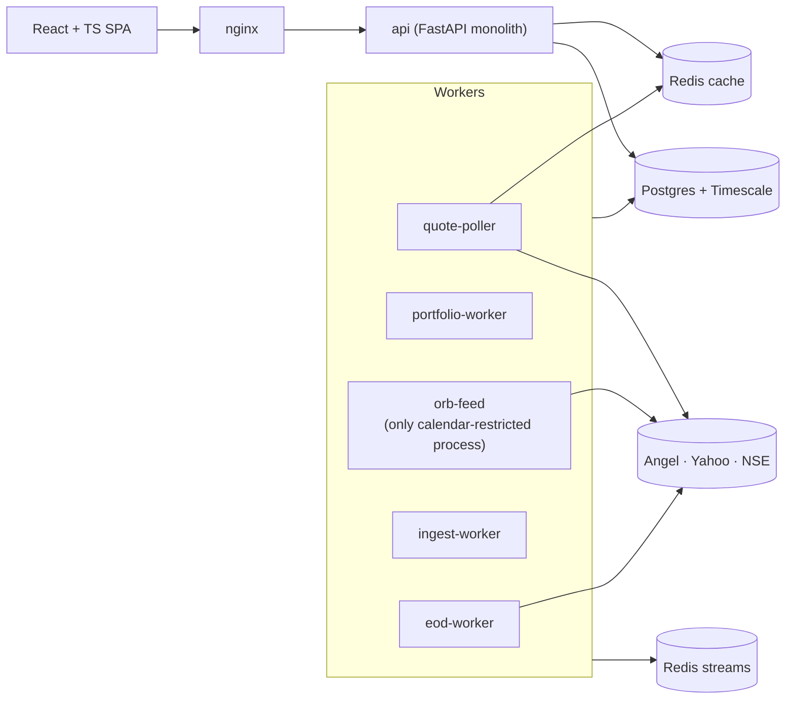

# Portfolio Intelligence v2 — Platform Plan

**Status:** planning only · draft for approval · 21 Sep 2026 · branch `docs/v2-platform-plan`
**No application code was changed to produce this plan.**

## What this is

A plan to turn the current app (v1: Mongo, per-process caches, provider calls on the request path, JSX with hand-rolled fetching) into an upgraded platform modelled on `quest-mf`: Postgres + TimescaleDB, Redis, precomputed reads, separate workers, a typed React frontend, and binding agent rules.

It is built on **measurements of the real app** ([audit](00-CURRENT-STATE-AUDIT.md)), not on assumptions. The headline: v1 is fast when warm (1–70 ms) and slow when cold (0.9–7 s), because all its speed comes from per-process dictionaries and its cold path computes and calls brokers on the request.

## Reading order

| # | Document | Read it for |
|---|---|---|
| 1 | [00 Current-state audit](00-CURRENT-STATE-AUDIT.md) | the evidence and root causes |
| 2 | [HLD](architecture/HLD.md) | the target system, decisions D1–D14, flows, capacity |
| 3 | [Domain rules R1–R18](DOMAIN-RULES.md) | the metric spec (the correctness contract) |
| 4 | [LLD: database](architecture/LLD-database.md) | schema, Mongo→Postgres map, migration verification |
| 5 | [LLD: cache](architecture/LLD-cache.md) | Redis design, keys, invalidation |
| 6 | [LLD: backend](architecture/LLD-backend.md) | modules, `pi_core`, workers, API |
| 7 | [LLD: frontend](architecture/LLD-frontend.md) | features, state, charts, design system |
| 8 | [Deployment](architecture/DEPLOYMENT.md) | port registry, topology, restart rules, runbooks |
| 9 | [Migration plan](MIGRATION-PLAN.md) | phases, exit gates, cutover, rollback |
| 10 | [Open decisions](OPEN-DECISIONS.md) | what I need from you |
| 11 | [Agent playbooks](AGENT-PLAYBOOKS.md) | recipes; companion to the root `AGENTS.md` |
| — | [ADRs 0001–0008](../decisions/) | the individual decisions |
| — | [`AGENTS.md`](../../AGENTS.md) (repo root) | binding rules for agents and contributors |

## The target in one picture

## Targets (from the audit's cold-path numbers)

| Read | v1 cold* | v2 target (cold = warm) |
|---|---:|---:|
| Client summary | 7,048 ms | ≤ 150 ms |
| Client performance series | 2,639 ms · 483 KB | ≤ 120 ms · ≤ 60 KB gz |
| Manager performance series | 6,984 ms · 693 KB | ≤ 200 ms |
| Dashboard first-paint requests | 19 | 4 |

## Honest caveats

- **Latency figures (*)** were measured on the working-tree v1, which includes the undeployed metric fixes (a bigger daily series than production emits today). The cold-vs-warm shape holds; absolute payloads overstate today's production. See the audit's caveat.
- **A database swap alone does not fix speed.** Precompute, an owned price store and out-of-band quotes do. Postgres is chosen for integrity and candle storage (ADR-0002).
- **I did not read production.** VM size, process config, backups and port exposure are listed in [open decisions](OPEN-DECISIONS.md) §B as unverified.
- **Effort figures are rough (±50 %).** They order the work; they are not a schedule.
- **The metric fixes are not yet deployed.** They sit uncommitted on `main`'s working tree; Phase 0.1 ships them first.
- **quest-mf's own docs contradict each other** (six microservices in the HLD, a single monolith in the approved amendment). v2 follows the amendment (ADR-0001). Its HLD should be updated separately.
