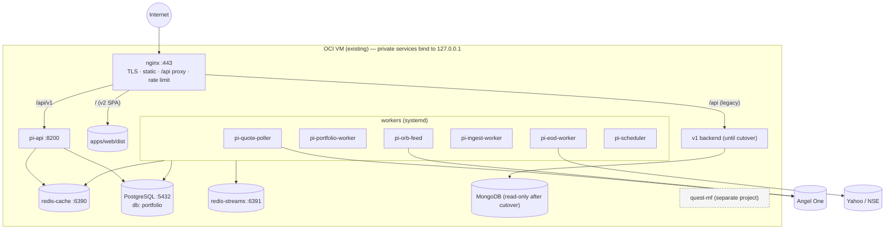
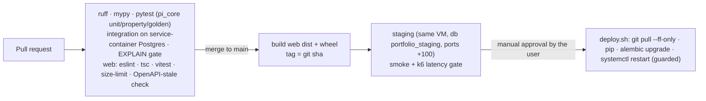

# Portfolio Intelligence v2 — Deployment on OCI

**Parent:** [HLD](HLD.md) · **Modelled on:** `quest-mf/docs/architecture/DEPLOYMENT-OCI.md`
**Phase 1:** systemd on the existing VM (D13, Open Decision O-4) · **Phase 2 (optional):** containers / second VM

> Facts I could not verify without touching production are marked **[verify in Phase 0]**. I did not read the production box while writing this.

---

## 1. Port registry (single source of truth)

> Changing a port means updating this table, `infra/systemd/*.service`, `infra/nginx/*.conf`, the OCI security list, and the Vite dev proxy **in the same PR**.

**Collision found while writing this:** quest-mf's monolith listens on **8000** and its Redis on **6379**, and its CHANGELOG puts its Postgres and Redis on `140.245.194.172`, the *same host* as this app. v2 therefore uses distinct ports and its own Redis instances.

| Component | Port | Bind | Exposed to | Health |
|---|---:|---|---|---|
| nginx (TLS) | 443 / 80→301 | 0.0.0.0 | Internet | `/nginx-health` |
| v2 web (static `dist`) | — | nginx `root` | nginx | `/` |
| **v2 `api`** | **8200** | 127.0.0.1 | nginx | `/healthz`, `/readyz` |
| `quote-poller` health/metrics | 8201 | 127.0.0.1 | local | `/healthz` |
| `portfolio-worker` | 8202 | 127.0.0.1 | local | `/healthz` |
| `eod-worker` | 8203 | 127.0.0.1 | local | `/healthz` |
| `ingest-worker` | 8204 | 127.0.0.1 | local | `/healthz` |
| `orb-feed` | 8205 | 127.0.0.1 | local | `/healthz` |
| `scheduler` | 8206 | 127.0.0.1 | local | `/healthz` |
| PostgreSQL 16 (shared cluster; DB `portfolio`) | 5432 | **127.0.0.1 / private IP only** | apps | `pg_isready` |
| **Redis cache** | **6390** | 127.0.0.1 | apps | `PING` |
| **Redis streams** | **6391** | 127.0.0.1 | apps | `PING` |
| v1 backend (until cutover) | existing **[verify in Phase 0]** | — | nginx | — |
| quest-mf API / DB / Redis | 8000 / 5432 / 6379 | — | not touched by this project | — |

## 2. Topology (one VM)



## 3. Process supervision (systemd; replaces pm2)

One unit per process in `infra/systemd/`:

```ini
# pi-api.service
[Unit]  Description=Portfolio Intelligence API   After=network.target postgresql.service redis-pi-cache.service
[Service]
User=pi  WorkingDirectory=/var/www/portfolio-v2/apps/api
EnvironmentFile=/etc/pi/api.env                      # 0600, root:pi — secrets never in git
ExecStart=/var/www/portfolio-v2/.venv/bin/uvicorn pi_api.main:app --host 127.0.0.1 --port 8200 --loop uvloop --http httptools --workers 2 --proxy-headers
Restart=always  RestartSec=2  TimeoutStopSec=30
LimitNOFILE=65536  MemoryMax=1G
[Install] WantedBy=multi-user.target
```

Workers follow the same pattern. `pi-orb-feed.service` is the only unit with a documented restart restriction (§6).

## 4. nginx (excerpt)

```nginx
limit_req_zone $binary_remote_addr zone=perip:20m rate=30r/s;
limit_req_zone $binary_remote_addr zone=auth:10m  rate=5r/m;
upstream pi_api { server 127.0.0.1:8200; keepalive 32; }

server {
  listen 443 ssl; http2 on;
  add_header X-Content-Type-Options nosniff always;
  add_header Referrer-Policy strict-origin-when-cross-origin always;
  add_header Strict-Transport-Security "max-age=31536000" always;
  add_header Content-Security-Policy "default-src 'self'; img-src 'self' data:; style-src 'self' 'unsafe-inline'; connect-src 'self'" always;
  gzip on; gzip_types application/json text/css application/javascript image/svg+xml;   # brotli if the module is present
  proxy_http_version 1.1; proxy_set_header Connection ""; proxy_set_header X-Request-ID $request_id;
  proxy_connect_timeout 2s; proxy_read_timeout 15s;

  location /api/v1/auth/   { limit_req zone=auth burst=5 nodelay; proxy_pass http://pi_api; }
  location /api/v1/        { limit_req zone=perip burst=60;       proxy_pass http://pi_api; }   # NO microcache: responses are per-user
  location /assets/        { root /var/www/portfolio-v2/apps/web/dist; expires 1y; add_header Cache-Control "public, immutable"; }
  location /               { root /var/www/portfolio-v2/apps/web/dist; try_files $uri /index.html; add_header Cache-Control "no-cache"; }
}
```

CORS in the API is an explicit allow-list. (The retired v1 workflow set `CORS_ORIGINS=*`.)

## 5. Storage and the disk problem

Root disk **30 GB, 75 % used (7.5 GB free)** at last observation **[re-verify in Phase 0]**. v1 alone holds a 2.2 GB candle collection.

| Action | Effect |
|---|---|
| Timescale compression on `candles_1m` after 14 days and `eod_prices` after 180 days | ~90 % smaller (vendor figure; measure on our data in Phase 2) |
| Move Postgres data, Object Storage cache and raw tradebooks to a **separate block volume** (Always-Free allows up to 200 GB) | removes root-disk pressure |
| Archive v1 candles to Parquet before dropping Mongo | one-time |
| Retention: raw provider payloads 1 year, then archive tier | bounded growth |
| Log rotation for every unit; `journald` size cap | prevents log fill-ups |

**Do this in Phase 0, before any data migration.** A migration on a 75 %-full disk is the most likely way to take production down.

## 6. Restart and deploy rules

| Process | Rule |
|---|---|
| `pi-api`, `pi-portfolio-worker`, `pi-ingest-worker`, `pi-eod-worker`, `pi-scheduler`, `pi-quote-poller` | restart **any time** (idempotent, or stateless) |
| **`pi-orb-feed`** | **never restart 08:45–15:30 IST on a trading day.** A restart breaks the day's feed subscription. `deploy.sh` refuses unless `--force` and an explicit confirmation |
| DB migrations | **expand → migrate → contract**; each release is backward-compatible with the previous one; migrations run before the new code starts |
| v1 backend (until cutover) | the same 08:45–15:30 IST rule applies, because v1 still hosts the feed |

This is the practical payoff of D7: v2 lets you ship API and worker changes during market hours.

## 7. CI/CD (GitHub Actions)



Rules: immutable tag per release; rollback = redeploy the previous tag; **agents never run the production step** (AGENTS §8).

## 8. Environments

| Env | Where | Database | Data |
|---|---|---|---|
| `local` | dev Mac (Homebrew Postgres + Redis, venv) | `portfolio_dev` | restored, **anonymised** dump |
| `staging` | the VM | `portfolio_staging` | production copy, refreshed on demand |
| `prod` | the VM | `portfolio` | live |

Production dumps contain client PII. They are taken and copied **by the user**, never by an agent; the copy is gitignored and deleted after use (AGENTS §9).

## 9. Security checklist (Phase 0 gate)

- [ ] **Confirm Postgres/Redis are not internet-reachable.** quest-mf's CHANGELOG says the dev machine connects straight to `140.245.194.172:5432/6379`; either those ports are open to the world or allow-listed to one IP. quest-mf's own rule (AGENTS §9) forbids exposure. **[verify in Phase 0]**
- [ ] Data ports bind to `127.0.0.1` or the private IP; OCI security list allows only 22 (Bastion/allow-listed), 80, 443.
- [ ] Secrets in `/etc/pi/*.env` (`0600`), never in the repo, logs or URLs; the single shared admin password used by v1 is retired in favour of per-user accounts, and should be rotated at cutover.
- [ ] argon2id everywhere; RS256 keys generated once, private key root-only.
- [ ] Restricted CORS; CSP header; HSTS.
- [ ] Encrypted backups; restore drill passes.
- [ ] Data-protection review of client PII (names, client codes, positions) under India's DPDP Act. Needs a person, not a code change.

## 10. Observability

| Signal | How |
|---|---|
| Logs | structured JSON with `request_id`, to journald, shipped to a file with rotation |
| Metrics | Prometheus `/metrics` on each process (request latency, cache hits, quote age, stream lag, job duration) |
| Slow queries | `pg_stat_statements` + `log_min_duration_statement=200ms` |
| Freshness | `/api/v1/ops/freshness`: last price date, benchmark sessions-behind, quote age, last EOD run |
| Alerts (email first) | poller silent > 60 s in market hours · EOD not complete by 17:30 IST · benchmark stale · `.dlq` non-empty · disk > 80 % · backup failed |

## 11. Runbooks (short form)

| Situation | Steps |
|---|---|
| Quotes look stale | `/ops/freshness` → `qstat` in Redis → `journalctl -u pi-quote-poller` → provider health row → restart the poller (safe any time) |
| EOD missing | `ops.job_runs` for `eod` → `dq_issues` → re-emit `jobs.eod {date}` (idempotent) |
| A client's numbers look wrong | `portfolio.client_daily.engine_version/computed_at` → re-emit `trades.changed {client}`; compare to the golden fixture of the same shape |
| Benchmark line flat | `market.benchmark_health` → `sessions_behind` → fix the provider symbol; **never** patch by hand |
| Disk > 80 % | run compression, archive old raw payloads, expand the volume |
| Bad release | redeploy the previous tag; migrations are expand-only, so the older code still runs |
| DB lost | restore from pgBackRest/wal-g into a new instance → run Q1–Q8 and the golden suite → repoint |
