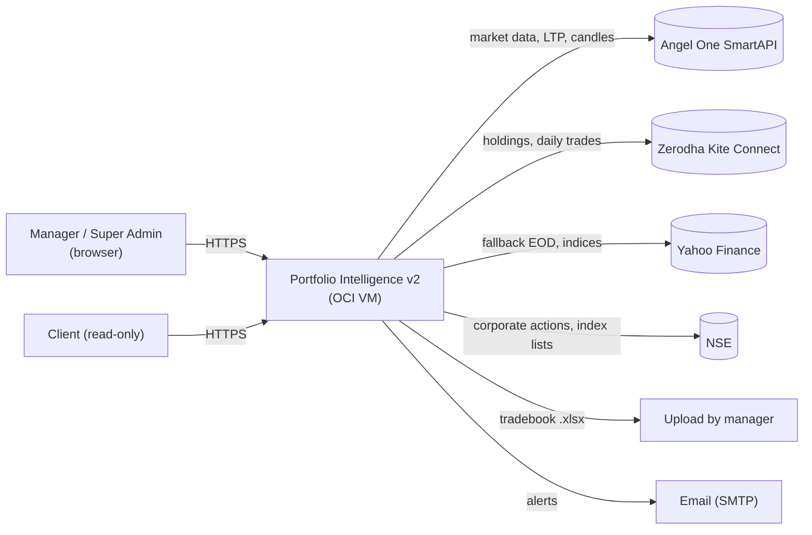
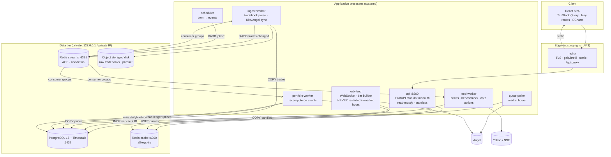
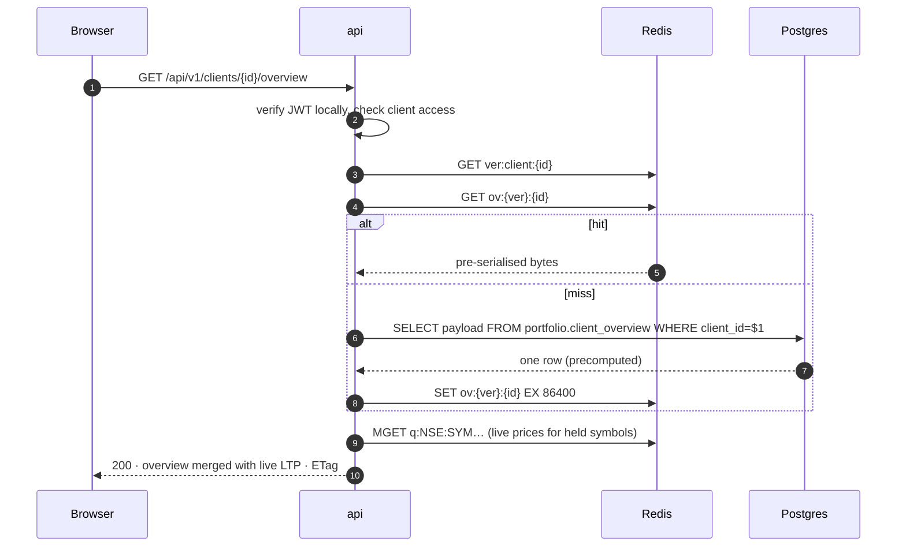
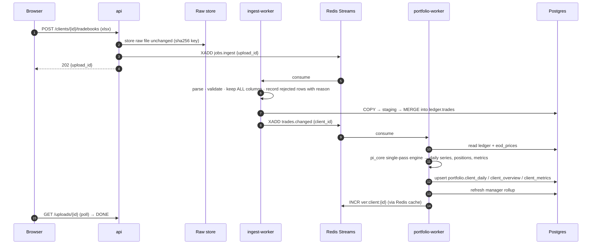
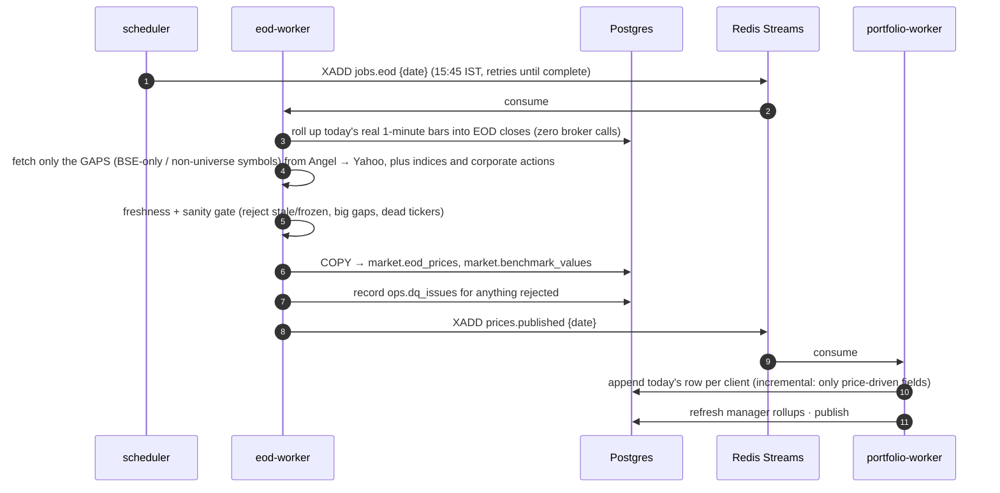
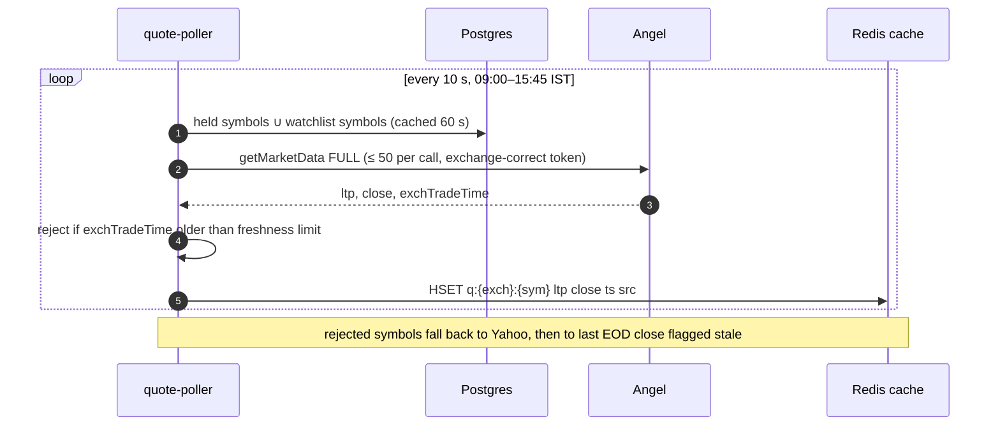

# Portfolio Intelligence v2 — High-Level Design (HLD)

**Status:** draft for approval · 21 Sep 2026
**Read with:** [Audit](../00-CURRENT-STATE-AUDIT.md) · [LLD-backend](LLD-backend.md) · [LLD-database](LLD-database.md) · [LLD-cache](LLD-cache.md) · [LLD-frontend](LLD-frontend.md) · [Deployment](DEPLOYMENT.md) · [Domain rules](../DOMAIN-RULES.md) · [Migration plan](../MIGRATION-PLAN.md) · [Agent rules](../../../AGENTS.md)
**Modelled on:** `quest-mf` (`/Volumes/SSD/quest-mf`). Where v2 departs from quest-mf, the departure is stated and justified.

---

## 1. Goals and non-functional requirements

| # | Requirement | Target |
|---|---|---|
| N1 | Client overview API | p95 ≤ 150 ms, **cold = warm** (no cache dependence) |
| N2 | Performance chart series | p95 ≤ 120 ms; ≤ 60 KB gzip; ≤ 800 points, columnar |
| N3 | Manager book overview (50 clients) | p95 ≤ 200 ms |
| N4 | Holdings with live prices | p95 ≤ 100 ms; price age always shown |
| N5 | Quote freshness (market hours) | ≤ 15 s old, else flagged `stale` |
| N6 | Tradebook upload (5k rows) → dashboards current | ≤ 10 s |
| N7 | End-of-day pipeline | complete ≤ 10 min after prices land |
| N8 | Frontend | initial JS ≤ 150 KB gz · route chunk ≤ 80 KB gz · LCP ≤ 1.5 s · INP ≤ 200 ms |
| N9 | Deploys | API can be deployed at any time, **without touching the ORB feed** |
| N10 | Correctness | every metric traces to a rule in [DOMAIN-RULES](../DOMAIN-RULES.md) with a golden test |
| N11 | Security | DB and Redis private; argon2id; no shared admin secret; audit log; tokens not in localStorage |
| N12 | Headroom | 100 clients · 1 M trades · 200 M one-minute bars with no redesign |
| N13 | Recovery | RPO ≤ 15 min · RTO ≤ 1 h · restore drill quarterly |
| N14 | Cost | one OCI VM to start; a second VM is an upgrade, not a prerequisite |

## 2. Key architectural decisions

| ID | Decision | Why (evidence) | Rejected |
|---|---|---|---|
| **D1** | **Precompute; the API only reads.** Per-client daily series, positions, metrics and manager rollups are written by workers into tables. | R1: the cold path is compute (7 s). | Caching the compute: still slow on every miss. |
| **D2** | **Own the price data.** EOD closes and 1-minute candles live in our database. **Daily closes are rolled up from the live ORB 1-minute feed** (your standing preference; v1 already does this nightly at 16:00 IST via `orb_daily_rollup.py`), and providers (Angel, Yahoo, NSE) are used **only by workers, only for gaps** (BSE-only symbols, history before the feed existed). Never by a request. | R2: provider I/O on the request path; a frozen feed produced a 13.6 % error. The feed already captures ~2,690 symbols, so most closes cost zero broker calls. | Live provider calls per request; a scheduled Angel backfill (v1's original, never-scheduled approach that let the screener go stale). |
| **D3** | **Quote poller → Redis.** One worker batch-polls the union of held symbols during market hours and writes `q:{exch}:{sym}` with a timestamp. Requests read Redis and fall back to the last EOD close, flagged. | N4/N5, one provider call per 50 symbols per 10 s instead of per page view. | Per-request quotes; per-process quote caches. |
| **D4** | **PostgreSQL 16 + TimescaleDB** is the system of record. See ADR-0002 for the honest trade-off: this fixes integrity and candle storage, **not** latency by itself. | Money needs `NUMERIC` and constraints; point-in-time joins; candle data needs compression (2.2 GB now). | Staying on Mongo: workable for the small data, wrong for candles and relational rules. |
| **D5** | **Redis 7** with two instances: cache (`allkeys-lru`) and streams (`noeviction`, AOF). Versioned keys, never `KEYS`/`SCAN` deletes. | R3: eleven private dict caches. | Continuing per-process caches. |
| **D6** | **Modular monolith API** (FastAPI, one deployable) **plus separate worker processes.** No microservices. | quest-mf's own 2026-09-17 amendment made the same call; one developer; v1 is already a monolith. | quest-mf HLD's six services on six ports. |
| **D7** | **ORB feed runs as its own process.** The API never hosts it. | Audit §8: restarting the API breaks the ORB feed, forcing calendar-bound deploys. | Feed inside the API (v1). |
| **D8** | **`pi_core`: a pure domain library** (FIFO engine, windows, TWR, XIRR, benchmark PME, allocation). No I/O, no clock, no globals. Single-pass algorithms. | v1 mixes math with I/O; correctness rules must be unit-testable. | Domain logic in routers/services. |
| **D9** | **Contract-first API.** Pydantic v2 response models → OpenAPI → generated TypeScript types. Money and percentages have fixed units (see DOMAIN-RULES R12). | Audit §9: percent-unit bugs, hand-typed shapes. | Hand-written client types. |
| **D10** | **React 19 + TypeScript + Vite + TanStack Query/Table/Virtual + Zustand + Tailwind v4 + shadcn/ui + ECharts.** Same stack as quest-mf. | Shared design system; server state and lists handled by libraries. | Keeping JSX + hand-rolled `useAsync`. |
| **D11** | **Auth: RS256 access token (15 min) + httpOnly refresh cookie; argon2id passwords; no shared admin env password.** Roles `super_admin`, `manager`, `client` (read-only). | v1 compares a plaintext env password and issues 14-day HMAC tokens. | Keep the basic gate. |
| **D12** | **Strangler migration**: v2 runs beside v1, migrated by read-path slice, verified against golden fixtures, cut over per manager. See [MIGRATION-PLAN](../MIGRATION-PLAN.md). | Big-bang rewrites of financial software fail quietly. | Big-bang cutover. |
| **D13** | **systemd on the host for now** (Postgres, Redis, API, workers), nginx unchanged; containers deferred. **Open decision O-4.** | One VM; v1 already runs without Docker; quest-mf's amendment is "zero-Docker". | Compose on day 1. |
| **D14** | **Observability baseline**: structured JSON logs with `request_id`, Prometheus `/metrics`, slow-query log, health/readiness endpoints, per-job run table. | v1 has logs only. | Adding it "later". |

## 3. System context



## 4. Container architecture



### 4.1 Process catalogue

| Process | Runs | Scales by | Restart rule |
|---|---|---|---|
| `api` | always | replicas (gunicorn/uvicorn workers) | **any time** (zero-downtime) |
| `quote-poller` | 09:00–15:45 IST | 1 | any time; loses ≤ 10 s of quotes |
| `portfolio-worker` | always | consumers | any time (idempotent) |
| `eod-worker` | after 15:45 IST + retries | 1 | any time |
| `ingest-worker` | on upload / cron | consumers | any time |
| **`orb-feed`** | 08:45–15:30 IST | 1 | **never 08:45–15:30 IST** |
| `scheduler` | always | 1 (Redis leader lock) | any time |

The last-but-one row is the point of D7: only one process is calendar-constrained, and it is not the one that changes often.

## 5. Bounded contexts (modules inside the monolith)

```text
auth        users, sessions, roles, audit log
tenancy     managers, clients, access rules
ledger      tradebook uploads, trades, dividends, manual adjustments, corporate actions
market      securities master, EOD prices, candles, benchmarks, quotes (read)
portfolio   positions, daily series, metrics, allocation, playbook, exports
research    sector research, screener, ORB signals, watchlists, board, theses
ops         job runs, data-quality issues, freshness, health
```

Rule: a module writes only its own tables. Other modules read through its **repository interface**, not its tables directly.

## 6. Core flows

### 6.1 Client dashboard read (the hot path)



The database row is already computed, so the miss path is one indexed `SELECT`. Live prices are merged at the edge because they change every few seconds and must not be baked into a versioned cache entry.

### 6.2 Tradebook upload → dashboards current



### 6.3 End-of-day pipeline



Incremental means each night touches one row per client, not the full history.

### 6.4 Live quotes



## 7. Capacity and volume model

| Table | Now | Design ceiling | Technique |
|---|---:|---:|---|
| `ledger.trades` | 8.9 k | 1 M | btree `(client_id, trade_date)`; no partitioning needed |
| `portfolio.client_daily` | ~25 k | 5 M | 1 row/client/day; PK `(client_id, as_of)` |
| `market.eod_prices` | ~0.5 M est. | 50 M | hypertable, compressed |
| `market.candles_1m` | **39 M** bars | 200 M+ | hypertable, compress > 7 days (Timescale reports ~90 % reduction) |
| everything else | < 10 k | < 1 M | plain tables |

Only `candles_1m` and `eod_prices` need Timescale. Everything else is ordinary Postgres, so the operational footprint stays small.

## 8. Cross-cutting concerns

| Concern | Approach |
|---|---|
| Config | 12-factor env via `pydantic-settings`; secrets from a root-only env file (OCI Vault later); never in git or logs |
| Time | business dates are `DATE` in IST; timestamps are `timestamptz` UTC; market calendar is one module |
| Idempotency | every event handler dedupes on `event_id`; uploads dedupe on `(client_id, trade fingerprint)` |
| Lineage | derived rows carry `computed_at`, `engine_version`, `data_snapshot_id` |
| Resilience | timeouts on all I/O; Redis failure falls through to Postgres; circuit breaker per provider; dead-letter streams |
| Rate limiting | nginx `limit_req` per IP and per token; broker limits enforced in one limiter class |
| Audit | logins, uploads, deletes, manual trades, admin actions → `auth.audit_log` |
| PII | client names/codes only; no tokens or bodies in logs; DB dumps are handled per AGENTS §9 |

## 9. Environments

| Env | Where | Data |
|---|---|---|
| `local` | dev Mac; Postgres + Redis via Homebrew; venv | restored **anonymised** production dump |
| `staging` | same VM, separate database and ports | full copy, refreshed on demand |
| `prod` | OCI VM | live |

## 10. Risks

| Risk | Mitigation |
|---|---|
| Rewrite drifts from v1 numbers | Golden fixtures from real data; v2 is measured against **rules**, and a documented diff report explains each intentional change |
| One VM is a single point of failure | Backups + restore drill first; second VM is an upgrade path |
| Disk (75 % used) | Compression + retention on candles; disk plan in MIGRATION Phase 0 |
| Provider breakage (Angel/Yahoo/NSE) | Ingest gates, dead-ticker alerts, fallback chain, all in workers so pages never break |
| **Angel session ownership.** v1 shares one Angel login inside one process. Splitting into `orb-feed`, `quote-poller` and `eod-worker` could make each login invalidate the others (v1's `angel.py` already re-authenticates when "a token was invalidated by a login elsewhere"). | **One session owner**: a leader-elected process logs in once, publishes the tokens to Redis; the others read them and ask the owner to refresh. Rate limits use a Redis token bucket shared across processes. **Spike S-1 (Phase 0.7) proves Angel's real concurrency behaviour before this design is committed.** Staging and local dev must never log in with production Angel credentials while the production feed is running. |
| Shared VM with quest-mf | Separate database, role and connection limits; capacity check is Open Decision O-1 |
| Scope creep | The ORB engine and screener are ported last (Phase 5); portfolio read path first |
| Regulatory | No investment advice wording; see AGENTS §9 |
