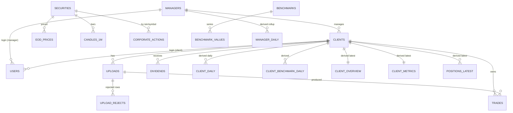

# Portfolio Intelligence v2 — Low-Level Design: Database

**Engine:** PostgreSQL 16 + TimescaleDB ≥ 2.14 · **Migrations:** Alembic (the only way to change the schema)
**Parent:** [HLD](HLD.md) · **Cache:** [LLD-cache](LLD-cache.md) · **Rules:** [DOMAIN-RULES](../DOMAIN-RULES.md)

---

## 1. Conventions

| Rule | Detail |
|---|---|
| Naming | `snake_case`; plural table names; PK `<entity>_id`; FK has the referenced column's name |
| Schemas | `core`, `auth`, `ledger`, `market`, `portfolio`, `research`, `orb`, `ops` |
| Money | `NUMERIC(18,2)` for rupee values, `NUMERIC(18,4)` for prices, `NUMERIC(18,6)` for quantities. **Never float in storage.** |
| Ratios | returns and percentages are stored as **decimals** (`0.1973` = 19.73 %) in `REAL`/`DOUBLE PRECISION`. Multiply by 100 only in the UI formatter (rule R12). |
| Dates | business dates `DATE` in IST; event times `TIMESTAMPTZ` (UTC) |
| Nullability | `NOT NULL` by default; `NULL` only when "unknown" is meaningful (e.g. charges) |
| Identity | new rows use `UUID`/identity keys; every migrated row keeps `legacy_id` (the 24-hex Mongo id) so old URLs and audit trails still resolve |
| Deletes | ledger data is never hard-deleted through the API; a delete is a tombstone row (`deleted_at`). Derived tables are replaced, never edited by hand. |
| Ownership | **derived tables (`portfolio.*`) are written only by workers.** The API has read-only access to them. |
| Time series | hypertable only where volume demands it (`candles_1m`, `eod_prices`, `benchmark_values`); every query has a time predicate |
| Bulk writes | `COPY` → staging → `MERGE`/upsert. No per-row insert loops. |

## 2. Roles

```sql
CREATE ROLE pi_migrator LOGIN;   -- DDL owner, used only by Alembic
CREATE ROLE pi_api      LOGIN;   -- RW auth, research; RO core, ledger, market, portfolio
CREATE ROLE pi_worker   LOGIN;   -- RW ledger, market, portfolio, ops, orb; RO core
CREATE ROLE pi_readonly LOGIN;   -- support / analytics; RO everything, no auth schema
```

All roles connect over the private interface only. A statement timeout of 2 s is set on `pi_api`; workers have none but carry `idle_in_transaction_session_timeout`.

## 3. Entity-relationship overview



## 4. DDL (target schema; first migrations)

### 4.0 Extensions

```sql
CREATE EXTENSION IF NOT EXISTS timescaledb;
CREATE EXTENSION IF NOT EXISTS pg_trgm;             -- symbol / name search
CREATE EXTENSION IF NOT EXISTS citext;              -- case-insensitive email
CREATE EXTENSION IF NOT EXISTS pg_stat_statements;
CREATE SCHEMA core; CREATE SCHEMA auth; CREATE SCHEMA ledger; CREATE SCHEMA market;
CREATE SCHEMA portfolio; CREATE SCHEMA research; CREATE SCHEMA orb; CREATE SCHEMA ops;
```

### 4.1 `core` and `auth`

```sql
CREATE TABLE core.managers (
    manager_id  UUID PRIMARY KEY DEFAULT gen_random_uuid(),
    legacy_id   TEXT UNIQUE,
    name        TEXT   NOT NULL,
    firm        TEXT,
    email       CITEXT NOT NULL UNIQUE,
    is_active   BOOLEAN NOT NULL DEFAULT true,
    created_at  TIMESTAMPTZ NOT NULL DEFAULT now()
);

CREATE TABLE core.clients (
    client_id   UUID PRIMARY KEY DEFAULT gen_random_uuid(),
    legacy_id   TEXT UNIQUE,
    manager_id  UUID NOT NULL REFERENCES core.managers,
    name        TEXT NOT NULL,
    client_code TEXT,                                   -- broker client id, e.g. QPJ806
    broker      TEXT CHECK (broker IN ('ZERODHA','UPSTOX','ANGEL','OTHER')),
    status      TEXT NOT NULL DEFAULT 'ACTIVE' CHECK (status IN ('ACTIVE','INACTIVE')),
    created_at  TIMESTAMPTZ NOT NULL DEFAULT now()
);
CREATE UNIQUE INDEX clients_code_per_manager ON core.clients (manager_id, client_code) WHERE client_code IS NOT NULL;

CREATE TABLE auth.users (
    user_id       UUID PRIMARY KEY DEFAULT gen_random_uuid(),
    email         CITEXT NOT NULL UNIQUE,
    password_hash TEXT   NOT NULL,                      -- argon2id
    role          TEXT   NOT NULL CHECK (role IN ('super_admin','manager','client')),
    manager_id    UUID REFERENCES core.managers,
    client_id     UUID REFERENCES core.clients,
    is_active     BOOLEAN NOT NULL DEFAULT true,
    created_at    TIMESTAMPTZ NOT NULL DEFAULT now(),
    last_login_at TIMESTAMPTZ,
    CHECK ((role = 'manager' AND manager_id IS NOT NULL) OR
           (role = 'client'  AND client_id  IS NOT NULL) OR role = 'super_admin')
);
CREATE TABLE auth.refresh_tokens (
    token_hash BYTEA PRIMARY KEY, user_id UUID NOT NULL REFERENCES auth.users,
    expires_at TIMESTAMPTZ NOT NULL, revoked BOOLEAN NOT NULL DEFAULT false, created_at TIMESTAMPTZ NOT NULL DEFAULT now()
);
CREATE TABLE auth.audit_log (
    id BIGSERIAL PRIMARY KEY, user_id UUID, action TEXT NOT NULL, entity TEXT, entity_id TEXT,
    meta JSONB, at TIMESTAMPTZ NOT NULL DEFAULT now()
);
CREATE INDEX ON auth.audit_log (at DESC);
```

The v1 shared `ADMIN_PASSWORD` disappears: the super-admin is a row in `auth.users`.

### 4.2 `ledger`: what the broker gave us (append-only source of truth)

```sql
CREATE TABLE ledger.uploads (
    upload_id       UUID PRIMARY KEY DEFAULT gen_random_uuid(),
    legacy_id       TEXT UNIQUE,
    client_id       UUID NOT NULL REFERENCES core.clients,
    version         INT  NOT NULL,
    file_name       TEXT NOT NULL,
    file_sha256     BYTEA NOT NULL,
    raw_object_key  TEXT NOT NULL,                      -- the ORIGINAL file, stored unchanged
    broker_format   TEXT NOT NULL CHECK (broker_format IN ('ZERODHA','UPSTOX','OTHER')),
    date_from DATE, date_to DATE,
    rows_total INT NOT NULL, rows_imported INT NOT NULL, rows_duplicate INT NOT NULL, rows_rejected INT NOT NULL,
    status          TEXT NOT NULL CHECK (status IN ('QUEUED','PROCESSING','IMPORTED','PARTIAL','FAILED')),
    uploaded_by     UUID REFERENCES auth.users,
    uploaded_at     TIMESTAMPTZ NOT NULL DEFAULT now(),
    UNIQUE (client_id, file_sha256)
);

-- v1 kept only an error COUNT. v2 keeps every rejected row and why.
CREATE TABLE ledger.upload_rejects (
    upload_id UUID NOT NULL REFERENCES ledger.uploads, row_no INT NOT NULL,
    reason TEXT NOT NULL, raw JSONB NOT NULL, PRIMARY KEY (upload_id, row_no)
);

CREATE TABLE ledger.trades (
    trade_id        BIGINT GENERATED ALWAYS AS IDENTITY PRIMARY KEY,
    legacy_id       TEXT UNIQUE,
    client_id       UUID NOT NULL REFERENCES core.clients,
    fingerprint     TEXT NOT NULL,                      -- includes the broker trade id (keeps separate fills separate)
    symbol          TEXT NOT NULL,
    isin            TEXT,
    trade_date      DATE NOT NULL,
    exchange        TEXT NOT NULL CHECK (exchange IN ('NSE','BSE')),
    segment         TEXT NOT NULL DEFAULT 'EQ',         -- EQ | FO | CD | COM ... (rule R9)
    series          TEXT,
    trade_type      TEXT NOT NULL CHECK (trade_type IN ('buy','sell')),
    auction         BOOLEAN NOT NULL DEFAULT false,
    quantity        NUMERIC(18,6) NOT NULL CHECK (quantity > 0),
    price           NUMERIC(18,4) NOT NULL CHECK (price >= 0),   -- 0 allowed only for source='manual' bonus credits
    trade_value     NUMERIC(18,4) GENERATED ALWAYS AS (quantity * price) STORED,
    broker_trade_id TEXT,
    broker_order_id TEXT,
    executed_at     TIMESTAMPTZ,
    charges         NUMERIC(18,4),                      -- NULL = unknown, NOT zero (rule R15)
    charges_known   BOOLEAN NOT NULL DEFAULT false,
    source          TEXT NOT NULL CHECK (source IN ('upload','manual','kite','angel')),
    upload_id       UUID REFERENCES ledger.uploads,
    note            TEXT,
    extra           JSONB NOT NULL DEFAULT '{}',        -- every column the broker sent that has no typed home
    deleted_at      TIMESTAMPTZ,
    created_at      TIMESTAMPTZ NOT NULL DEFAULT now(),
    UNIQUE (client_id, fingerprint),
    CHECK (price > 0 OR source = 'manual')
);
CREATE INDEX trades_client_date   ON ledger.trades (client_id, trade_date, trade_id) WHERE deleted_at IS NULL;
CREATE INDEX trades_client_symbol ON ledger.trades (client_id, symbol, trade_date)  WHERE deleted_at IS NULL;

CREATE TABLE ledger.dividends (
    dividend_id BIGINT GENERATED ALWAYS AS IDENTITY PRIMARY KEY, client_id UUID NOT NULL REFERENCES core.clients,
    symbol TEXT NOT NULL, ex_date DATE NOT NULL, amount_per_share NUMERIC(18,4) NOT NULL,
    quantity NUMERIC(18,6) NOT NULL, source TEXT NOT NULL CHECK (source IN ('manual','nse'))
);

CREATE TABLE ledger.corporate_actions (
    action_id BIGINT GENERATED ALWAYS AS IDENTITY PRIMARY KEY,
    key TEXT NOT NULL UNIQUE, isin TEXT, symbol TEXT NOT NULL, ex_date DATE NOT NULL,
    type TEXT NOT NULL CHECK (type IN ('SPLIT','BONUS','DIVIDEND','DEMERGER','MERGER','BUYBACK','RIGHTS','DELISTING','OTHER')),
    qty_multiplier NUMERIC(18,8), amount_per_share NUMERIC(18,4), subject TEXT, source TEXT NOT NULL DEFAULT 'NSE',
    fetched_at TIMESTAMPTZ NOT NULL DEFAULT now()
);
CREATE INDEX ON ledger.corporate_actions (isin); CREATE INDEX ON ledger.corporate_actions (symbol, ex_date);

-- For sells with no matching buy (IPO allotment, demerger credit, transfer-in): the user supplies the cost.
CREATE TABLE ledger.cost_basis_adjustments (
    adjustment_id BIGINT GENERATED ALWAYS AS IDENTITY PRIMARY KEY, client_id UUID NOT NULL REFERENCES core.clients,
    symbol TEXT NOT NULL, quantity NUMERIC(18,6) NOT NULL, unit_cost NUMERIC(18,4) NOT NULL,
    acquired_on DATE, reason TEXT NOT NULL, created_by UUID REFERENCES auth.users, created_at TIMESTAMPTZ NOT NULL DEFAULT now()
);
```

### 4.3 `market`: prices we own (workers write, requests read)

```sql
CREATE TABLE market.securities (
    security_id  INT GENERATED ALWAYS AS IDENTITY PRIMARY KEY,
    symbol       TEXT NOT NULL, exchange TEXT NOT NULL CHECK (exchange IN ('NSE','BSE')),
    isin TEXT, name TEXT, sector TEXT, industry TEXT, asset_class TEXT, cap TEXT,
    angel_token TEXT, is_active BOOLEAN NOT NULL DEFAULT true,
    UNIQUE (symbol, exchange)
);
CREATE INDEX ON market.securities (isin);
CREATE INDEX securities_symbol_trgm ON market.securities USING gin (symbol gin_trgm_ops);

CREATE TABLE market.symbol_aliases (               -- renames, e.g. HBLPOWER -> HBLENGINE (same ISIN)
    old_symbol TEXT NOT NULL, new_symbol TEXT NOT NULL, isin TEXT NOT NULL, valid_from DATE NOT NULL, valid_to DATE,
    PRIMARY KEY (old_symbol, valid_from)
);

CREATE TABLE market.trading_calendar (
    cal_date DATE PRIMARY KEY, is_open BOOLEAN NOT NULL, session_open TIME, session_close TIME, note TEXT
);

-- AS-TRADED closing prices (rule R17): never split-adjusted, so quantity and price stay consistent.
CREATE TABLE market.eod_prices (
    security_id INT NOT NULL REFERENCES market.securities, price_date DATE NOT NULL,
    open NUMERIC(18,4), high NUMERIC(18,4), low NUMERIC(18,4), close NUMERIC(18,4) NOT NULL CHECK (close > 0),
    volume BIGINT, source TEXT NOT NULL, adjusted BOOLEAN NOT NULL DEFAULT false, ingest_id BIGINT,
    PRIMARY KEY (security_id, price_date)
);
SELECT create_hypertable('market.eod_prices', by_range('price_date', INTERVAL '1 year'));
ALTER TABLE market.eod_prices SET (timescaledb.compress, timescaledb.compress_segmentby = 'security_id', timescaledb.compress_orderby = 'price_date DESC');
SELECT add_compression_policy('market.eod_prices', INTERVAL '180 days');

-- Prices in integer paise (as v1 already stores them): 4 B ints compress far better than NUMERIC.
CREATE TABLE market.candles_1m (
    security_id INT NOT NULL REFERENCES market.securities, ts TIMESTAMPTZ NOT NULL,
    o INT NOT NULL, h INT NOT NULL, l INT NOT NULL, c INT NOT NULL, v BIGINT NOT NULL,
    synthetic BOOLEAN NOT NULL DEFAULT false,          -- gap-filled bars are flagged, never silent
    PRIMARY KEY (security_id, ts)
);
SELECT create_hypertable('market.candles_1m', by_range('ts', INTERVAL '7 days'));
ALTER TABLE market.candles_1m SET (timescaledb.compress, timescaledb.compress_segmentby = 'security_id', timescaledb.compress_orderby = 'ts DESC');
SELECT add_compression_policy('market.candles_1m', INTERVAL '14 days');

CREATE TABLE market.benchmarks (
    benchmark_id SMALLINT PRIMARY KEY, code TEXT NOT NULL UNIQUE,   -- NIFTY_50, NIFTY_MIDCAP_150 ...
    label TEXT NOT NULL, provider_symbol TEXT NOT NULL, is_tri BOOLEAN NOT NULL DEFAULT false, is_active BOOLEAN NOT NULL DEFAULT true
);
CREATE TABLE market.benchmark_values (
    benchmark_id SMALLINT NOT NULL REFERENCES market.benchmarks, value_date DATE NOT NULL,
    value NUMERIC(18,4) NOT NULL, source TEXT NOT NULL, PRIMARY KEY (benchmark_id, value_date)
);
SELECT create_hypertable('market.benchmark_values', by_range('value_date', INTERVAL '5 years'));

-- Dead-ticker alarm (rule R10): the Midcap 100 series silently stopped on 17 Jul 2026 and flatlined a chart for two months.
CREATE VIEW market.benchmark_health AS
SELECT b.code, max(v.value_date) AS last_date,
       (SELECT max(cal_date) FROM market.trading_calendar WHERE is_open AND cal_date <= current_date) AS last_session,
       (SELECT count(*) FROM market.trading_calendar c WHERE c.is_open AND c.cal_date > max(v.value_date) AND c.cal_date <= current_date) AS sessions_behind
FROM market.benchmarks b LEFT JOIN market.benchmark_values v USING (benchmark_id) WHERE b.is_active GROUP BY b.code;
```

### 4.4 `portfolio`: derived, written only by `portfolio-worker`

```sql
-- one row per client per market day: the whole time series behind every chart
CREATE TABLE portfolio.client_daily (
    client_id UUID NOT NULL REFERENCES core.clients, as_of DATE NOT NULL,
    market_value NUMERIC(18,2) NOT NULL,        -- value of open positions at that day's close
    open_cost    NUMERIC(18,2) NOT NULL,        -- cost basis of open positions ("current invested")
    net_invested NUMERIC(18,2) NOT NULL,        -- cumulative buys - sells (matched shares only, rule R7)
    realized_pnl NUMERIC(18,2) NOT NULL,
    twr_base     NUMERIC(18,2),                 -- execution-price-weighted capital base (rule R2)
    day_return   DOUBLE PRECISION,              -- time-weighted daily return, decimal
    nav          DOUBLE PRECISION NOT NULL,     -- indexed to 100 at the first day
    unpriced_cost NUMERIC(18,2) NOT NULL DEFAULT 0,   -- positions with no price, excluded from BOTH cost and value (R6)
    flags SMALLINT NOT NULL DEFAULT 0,
    engine_version TEXT NOT NULL, computed_at TIMESTAMPTZ NOT NULL DEFAULT now(),
    PRIMARY KEY (client_id, as_of)
);

CREATE TABLE portfolio.client_benchmark_daily (   -- index-units method (rule R10)
    client_id UUID NOT NULL, benchmark_id SMALLINT NOT NULL REFERENCES market.benchmarks, as_of DATE NOT NULL,
    units NUMERIC(24,8) NOT NULL, value NUMERIC(18,2) NOT NULL, pnl NUMERIC(18,2) NOT NULL,   -- pnl = value - net_invested
    PRIMARY KEY (client_id, benchmark_id, as_of)
);

CREATE TABLE portfolio.positions_latest (       -- what the API multiplies by live prices
    client_id UUID NOT NULL, security_id INT NOT NULL REFERENCES market.securities,
    quantity NUMERIC(18,6) NOT NULL, avg_cost NUMERIC(18,4) NOT NULL, invested NUMERIC(18,2) NOT NULL,
    entry_date DATE, applied_actions JSONB NOT NULL DEFAULT '[]', PRIMARY KEY (client_id, security_id)
);

CREATE TABLE portfolio.client_overview (        -- everything that does NOT depend on a live price
    client_id UUID PRIMARY KEY, as_of DATE NOT NULL, payload JSONB NOT NULL,   -- peak_capital, current_invested, realized, counts, warnings...
    engine_version TEXT NOT NULL, computed_at TIMESTAMPTZ NOT NULL DEFAULT now()
);
CREATE TABLE portfolio.client_metrics (         -- CAGR/total return, vol, Sharpe, drawdown, beta, alpha, XIRR
    client_id UUID PRIMARY KEY, as_of DATE NOT NULL, obs INT NOT NULL, payload JSONB NOT NULL,
    engine_version TEXT NOT NULL, computed_at TIMESTAMPTZ NOT NULL DEFAULT now()
);
CREATE TABLE portfolio.round_trips (            -- FIFO-matched closed lots: playbook and trade analytics read this
    client_id UUID NOT NULL, symbol TEXT NOT NULL, buy_date DATE NOT NULL, sell_date DATE NOT NULL,
    quantity NUMERIC(18,6) NOT NULL, buy_price NUMERIC(18,4) NOT NULL, sell_price NUMERIC(18,4) NOT NULL,
    pnl NUMERIC(18,2) NOT NULL, days INT NOT NULL, PRIMARY KEY (client_id, symbol, buy_date, sell_date, quantity)
);
CREATE TABLE portfolio.trade_analytics (client_id UUID PRIMARY KEY, as_of DATE NOT NULL, payload JSONB NOT NULL, computed_at TIMESTAMPTZ NOT NULL DEFAULT now());

CREATE TABLE portfolio.manager_daily (          -- rollup = SUM over the manager's clients; same numbers as the client pages by construction
    manager_id UUID NOT NULL, as_of DATE NOT NULL, market_value NUMERIC(18,2) NOT NULL, open_cost NUMERIC(18,2) NOT NULL,
    net_invested NUMERIC(18,2) NOT NULL, realized_pnl NUMERIC(18,2) NOT NULL, pnl NUMERIC(18,2) NOT NULL, PRIMARY KEY (manager_id, as_of)
);
CREATE TABLE portfolio.manager_benchmark_daily (
    manager_id UUID NOT NULL, benchmark_id SMALLINT NOT NULL, as_of DATE NOT NULL, pnl NUMERIC(18,2) NOT NULL, PRIMARY KEY (manager_id, benchmark_id, as_of)
);
```

Sizing: 16 clients × ~1,500 days ≈ 25 k rows in `client_daily`. The whole derived layer is a few MB, which is why serving it from Postgres with no cache is fast.

### 4.5 `research` and `orb` (ported in Phase 5; shapes kept close to v1)

```sql
CREATE TABLE research.watchlists (watchlist_id UUID PRIMARY KEY DEFAULT gen_random_uuid(), owner_type TEXT NOT NULL CHECK (owner_type IN ('MANAGER','CLIENT')), owner_id UUID NOT NULL, name TEXT NOT NULL, is_default BOOLEAN NOT NULL DEFAULT false);
CREATE TABLE research.watchlist_entries (watchlist_id UUID NOT NULL REFERENCES research.watchlists, symbol TEXT NOT NULL, added_date DATE NOT NULL, added_price NUMERIC(18,4), why TEXT, remarks TEXT, risks TEXT, sector TEXT, alert_price NUMERIC(18,4), alert_date DATE, PRIMARY KEY (watchlist_id, symbol));
CREATE TABLE research.board_items   (item_id UUID PRIMARY KEY DEFAULT gen_random_uuid(), owner_type TEXT NOT NULL, owner_id UUID NOT NULL, symbol TEXT NOT NULL, lane TEXT NOT NULL CHECK (lane IN ('watching','holding','exit')), entry_price NUMERIC(18,4), exit_price NUMERIC(18,4), why TEXT, colour TEXT, sort_order INT NOT NULL DEFAULT 0);
CREATE TABLE research.tags (tag_id BIGINT GENERATED ALWAYS AS IDENTITY PRIMARY KEY, client_id UUID NOT NULL, name TEXT NOT NULL, colour TEXT, description TEXT, UNIQUE (client_id, name));
CREATE TABLE research.trade_tags  (client_id UUID NOT NULL, trade_id BIGINT NOT NULL REFERENCES ledger.trades, tag_id BIGINT NOT NULL REFERENCES research.tags, PRIMARY KEY (trade_id, tag_id));
CREATE TABLE research.trade_notes (client_id UUID NOT NULL, trade_id BIGINT NOT NULL REFERENCES ledger.trades PRIMARY KEY, note TEXT NOT NULL, updated_at TIMESTAMPTZ NOT NULL DEFAULT now());
CREATE TABLE research.stock_theses(client_id UUID NOT NULL, symbol TEXT NOT NULL, thesis JSONB NOT NULL, updated_at TIMESTAMPTZ NOT NULL DEFAULT now(), PRIMARY KEY (client_id, symbol));
CREATE TABLE research.screener_snapshots (as_of DATE NOT NULL, model TEXT NOT NULL, payload JSONB NOT NULL, PRIMARY KEY (as_of, model));
-- orb.* : signals, journal, jobs, universe, health, backfill (verbatim shape from v1 orb_* collections, typed)
```

### 4.6 `ops`

```sql
CREATE TABLE ops.job_runs (run_id BIGINT GENERATED ALWAYS AS IDENTITY PRIMARY KEY, job TEXT NOT NULL, started_at TIMESTAMPTZ NOT NULL DEFAULT now(), finished_at TIMESTAMPTZ, status TEXT NOT NULL CHECK (status IN ('RUNNING','OK','FAILED','SKIPPED')), rows_in BIGINT, rows_out BIGINT, error TEXT, meta JSONB);
CREATE INDEX ON ops.job_runs (job, started_at DESC);
CREATE TABLE ops.ingest_log (ingest_id BIGINT GENERATED ALWAYS AS IDENTITY PRIMARY KEY, source TEXT NOT NULL, business_date DATE, raw_sha256 BYTEA, object_key TEXT, rows_in INT, rows_loaded INT, rows_rejected INT, retrieved_at TIMESTAMPTZ NOT NULL DEFAULT now(), UNIQUE (source, raw_sha256));
CREATE TABLE ops.dq_issues (issue_id BIGINT GENERATED ALWAYS AS IDENTITY PRIMARY KEY, check_name TEXT NOT NULL, severity TEXT NOT NULL CHECK (severity IN ('INFO','WARN','BLOCK')), entity_key TEXT NOT NULL, details JSONB, resolved BOOLEAN NOT NULL DEFAULT false, created_at TIMESTAMPTZ NOT NULL DEFAULT now());
CREATE TABLE ops.provider_health (provider TEXT NOT NULL, checked_at TIMESTAMPTZ NOT NULL DEFAULT now(), ok BOOLEAN NOT NULL, latency_ms INT, detail TEXT, PRIMARY KEY (provider, checked_at));
```

## 5. Mongo → Postgres mapping

| v1 Mongo collection | Docs | v2 target | Notes / risk |
|---|---:|---|---|
| `managers` | 3 | `core.managers` + `auth.users` | password hashes carried over; **super-admin becomes a user row** |
| `clients` | 16 | `core.clients` | `legacy_id` kept; `portfolio_manager_id` → `manager_id` |
| `uploads` | 33 | `ledger.uploads` | raw files were **not stored** in v1, so `raw_object_key` is NULL for legacy rows (documented gap) |
| `trades` | 8,925 | `ledger.trades` | `fingerprint` preserved verbatim; blank `segment` → `EQ`; `charges` 0.0 → `NULL, charges_known=false` |
| `dividends` | 0 | `ledger.dividends` | empty in production today |
| `corporate_actions` | 519 | `ledger.corporate_actions` | `key` unique preserved |
| `benchmark_prices` | 7,128 | `market.benchmark_values` | map symbol → `benchmark_id`; `^CRSMID` is dead and is replaced (rule R10) |
| `orb_candles_1m` | 104,041 | `market.candles_1m` | explode 7 parallel arrays → 39 M rows; synthetic bars flagged |
| `orb_candles_1d` | 2,699 | `market.eod_prices` | explode; **verify adjusted vs as-traded** (rule R17) before loading |
| `orb_calendar` | 739 | `market.trading_calendar` | |
| `watchlists`, `boards`, `tags`, `trade_tags`, `trade_notes`, `thesis`, `screener_snapshots`, `pdf_uploads` | small | `research.*` | shape kept; ids remapped via `legacy_id` |
| `orb_signals`, `orb_journal`, `orb_jobs`, `orb_universe`, `orb_health`, `orb_backfill` | small | `orb.*` | ported in Phase 5 |
| `classifications` (`store.json` fallback) | 0 | `market.securities` | the JSON fallback store is **retired** (206-method `JsonStore` disappears) |

## 6. Canonical queries (must stay index-backed; CI runs `EXPLAIN` on these)

| # | Query | Expected plan |
|---|---|---|
| Q1 | `SELECT payload FROM portfolio.client_overview WHERE client_id=$1` | PK lookup |
| Q2 | `SELECT as_of, nav, pnl … FROM portfolio.client_daily WHERE client_id=$1 AND as_of BETWEEN $2 AND $3 ORDER BY as_of` | PK range scan |
| Q3 | `SELECT … FROM portfolio.manager_daily WHERE manager_id=$1 AND as_of BETWEEN $2 AND $3` | PK range scan |
| Q4 | `SELECT … FROM portfolio.positions_latest WHERE client_id=$1` | PK prefix |
| Q5 | trade ledger page, keyset `(trade_date, trade_id) > ($2,$3)` | `trades_client_date` |
| Q6 | latest close per security: `DISTINCT ON (security_id) … WHERE security_id = ANY($1) AND price_date >= $2 ORDER BY security_id, price_date DESC` | chunk exclusion + PK |
| Q7 | candles for a symbol-day: `WHERE security_id=$1 AND ts >= $2 AND ts < $3` | chunk exclusion + PK |
| Q8 | symbol search `symbol ILIKE $1 || '%'` / `%` trigram | `securities_symbol_trgm` |

Rule: no `Seq Scan` on `trades`, `eod_prices`, `candles_1m`, `client_daily`.

## 7. Migration from Mongo (verifiable, repeatable, reversible)

1. **Freeze** v1 writes (maintenance window outside 08:45–15:30 IST) and take a `mongodump`.
2. **Extract** with a read-only script to Parquet/CSV. Nothing writes to Mongo.
3. **Transform** with the rules in §5 (ids remapped through `legacy_id`).
4. **Load** with `COPY` into the real tables inside one transaction per table family.
5. **Verify** (all must pass; the script prints a signed report):

| Check | Pass condition |
|---|---|
| Row counts per collection ↔ table | equal (allowing documented rejects) |
| Per client: trade count, Σ quantity, Σ quantity×price | equal to the cent |
| Fingerprint set per client | set-equal |
| Candle bars per symbol-day; Σ close per symbol-day | equal |
| Engine parity | run `pi_core` over the migrated ledger: realized P&L, open quantities and cost per client vs the v1 engine output, difference ≤ ₹0.01 |
| Idempotency | running the loader twice changes nothing |

6. **Keep Mongo read-only for 30 days**, then archive the dump. Rollback = point traffic back at v1 (untouched).

## 8. PostgreSQL tuning

RAM is unknown (Open Decision O-1). Parameterise from it, never hard-code:

| Setting | Rule of thumb | 8 GB VM | 16 GB VM |
|---|---|---:|---:|
| `shared_buffers` | 25 % of RAM | 2 GB | 4 GB |
| `effective_cache_size` | 60–70 % of RAM | 5 GB | 10 GB |
| `work_mem` | 16–32 MB | 16 MB | 32 MB |
| `maintenance_work_mem` | 256 MB–1 GB | 256 MB | 512 MB |
| `max_connections` | 60 (pool in the app) | 60 | 60 |
| `random_page_cost` | 1.1 (SSD) | 1.1 | 1.1 |
| `jit` | off | off | off |

`shared_preload_libraries = 'timescaledb,pg_stat_statements'`. Use `pgbouncer` only if the API scales beyond ~4 workers; with one VM, an in-app `asyncpg` pool is enough.

## 9. Backups and recovery

| What | How | RPO / RTO |
|---|---|---|
| Postgres | nightly `pg_dump` + continuous WAL archiving (pgBackRest or wal-g) to OCI Object Storage | RPO ≤ 15 min · RTO ≤ 1 h |
| Raw tradebooks | Object Storage, versioned | — |
| Redis cache | not backed up (rebuildable) | — |
| Redis streams | AOF everysec | ≤ 1 s |
| Restore drill | quarterly, into `staging`, then run Q1–Q8 and the golden-fixture suite | — |

**A restore drill happens before any migration cutover** (MIGRATION Phase 0). v1's backup state is unverified today.
